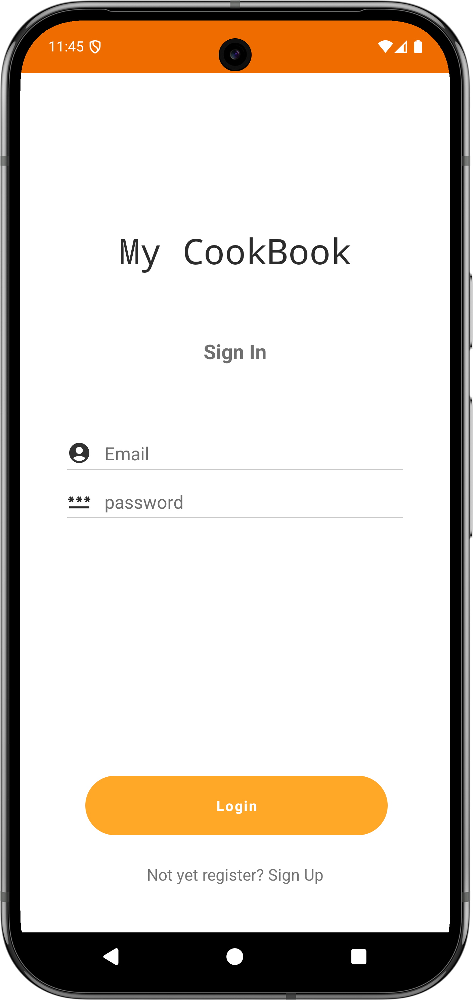
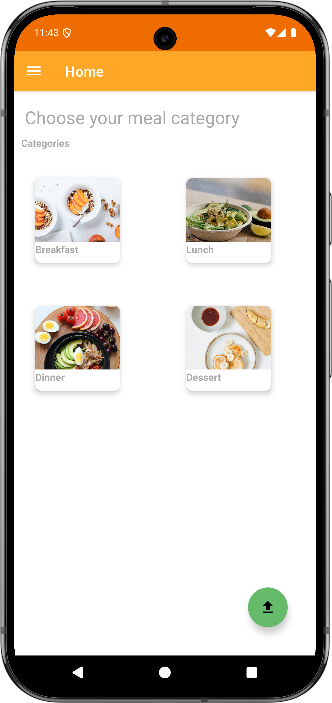
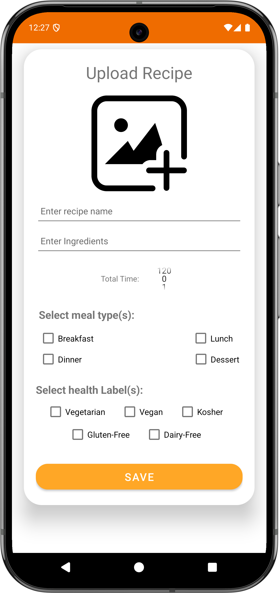
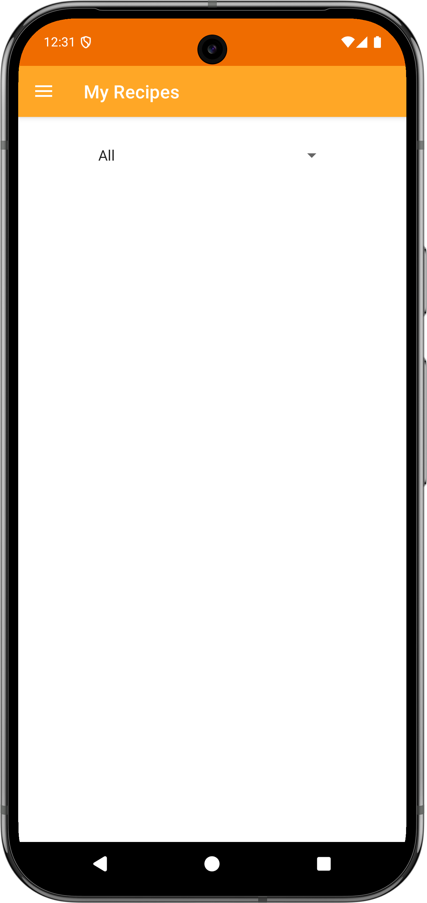
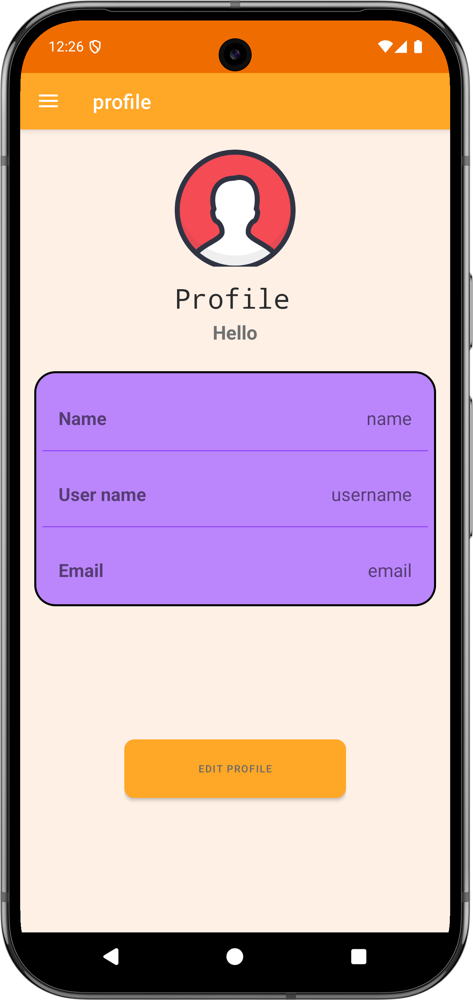

# Recipe Book Android App

   

A comprehensive Android application for discovering, sharing, and managing recipes. Built with Java using Firebase for backend services.

## Description

This application allows users to browse a collection of recipes, view detailed instructions and ingredients, upload their own creations, and manage their personal recipe collection. It features user authentication, recipe categorization, and potentially map integration for related functionalities.

## Features

* **User Authentication:** Secure Login and Registration using Firebase Authentication.
* **Recipe Browse:** View recipes on the home screen and by category.
* **Recipe Details:** See full recipe information including ingredients, instructions, cooking time, and image.
* **Recipe Upload:** Authenticated users can upload their own recipes with images.
* **My Recipes:** Users can view, update, and delete their own uploaded recipes.
* **User Profile:** View and edit user profile information.
* **Search:** Functionality to search for recipes (Verify implementation details).
* **Categorization:** Recipes organized into different categories.
* **Map Integration:** Includes map features (e.g., view recipe origins, find nearby ingredient stores - *Please specify the exact functionality*).

## Screenshots

*Add screenshots of your app here to showcase its features and UI.*

*(You will need to replace the paths like `images/login_screen.png` with the actual paths to your image files after adding them to your repository. Consider creating an `images` or `screenshots` folder.)*

| Login Screen          | Home Screen           | Recipe Detail             |
| :------------------ | :------------------ | :---------------------- |
|  |  |  |
| **Upload Recipe** | **My Recipes** | **Profile** |
|  |  |  |

## Technologies Used

* **Language:** Java
* **Platform:** Android SDK
* **Architecture:** (Likely MVVM or MVP - *Verify based on your structure*)
* **UI:** Android XML Layouts, Material Design Components, View Binding, RecyclerView, Navigation Component
* **Backend:** Firebase (Authentication, Realtime Database/Firestore, Storage)
* **Maps:** Google Maps SDK for Android
* **Image Loading:** (e.g., Glide, Picasso - *Check `app/build.gradle`*)
* **Build Tool:** Gradle

## Setup

Follow these steps to get the project running on your local machine for development and testing purposes.

**Prerequisites:**

* Android Studio (Latest stable version recommended)
* Java Development Kit (JDK)
* Android SDK installed
* An Android device or emulator

**Cloning the Repository:**

```bash
git clone [https://github.com/your-username/Recipe-Book-Android-App-dev.git](https://github.com/your-username/Recipe-Book-Android-App-dev.git)
cd Recipe-Book-Android-App-dev
